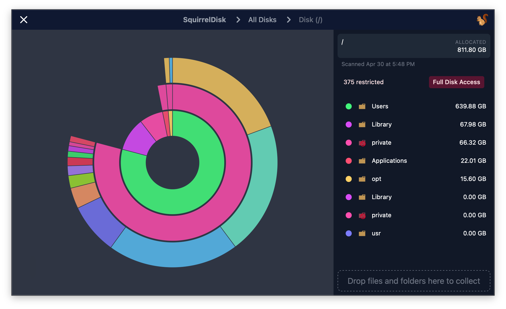

# SquirrelDisk

## What's taking your hard disk space?

The easiest open source app you will ever use to detect huge files. Built with Rust + React (Tauri).

Squirreldisk is an open source alternative to softwares like: WinDirStat, WizTree, TreeSize and DaisyDisk.

Some features:

- Fast scan and deep directory scanning
- Disk scanning or pick a directory
- External disks real-time detection
- A sunburst chart to quickly visualize the disk usage
- Drag and drop: collect all items to be deleted
- Right click on a folder/file to open the file explorer
- Cross-platform macOS, Windows, Linux

## Source

- Main repository: [git.iris.to](https://git.iris.to/#/npub1xdhnr9mrv47kkrn95k6cwecearydeh8e895990n3acntwvmgk2dsdeeycm/squirreldisk)
- GitHub mirror: [mmalmi/squirreldisk](https://github.com/mmalmi/squirreldisk)
- [Releases](https://git.iris.to/#/npub1xdhnr9mrv47kkrn95k6cwecearydeh8e895990n3acntwvmgk2dsdeeycm/squirreldisk?tab=releases)

## Installation

Please note that the current version is not 100% stable yet, and you may encounter bugs.

### Windows

1. Download the installer from the [release page](https://git.iris.to/#/npub1xdhnr9mrv47kkrn95k6cwecearydeh8e895990n3acntwvmgk2dsdeeycm/squirreldisk?tab=releases)
2. The binary is not signed so Windows could open a popup window warning you that the file is unsecure, just click on "More Information" > "Run Anyway"

[Why the binary isn't Codesigned and marked as unsafe?](https://news.ycombinator.com/item?id=19330062)

### Linux

1. Download the AppImage or .deb package from the [release page](https://git.iris.to/#/npub1xdhnr9mrv47kkrn95k6cwecearydeh8e895990n3acntwvmgk2dsdeeycm/squirreldisk?tab=releases)
2. Install

### macOS

1. Download the .dmg from the [release page](https://git.iris.to/#/npub1xdhnr9mrv47kkrn95k6cwecearydeh8e895990n3acntwvmgk2dsdeeycm/squirreldisk?tab=releases)
2. Install the app from the .dmg
3. Published macOS releases are signed and notarized.

## Disclaimer

This app was a project from 2 years ago built in Electron in 2 days, I decided to port it to Tauri to achieve better performances and to make it Open Source. Yay.

The code is still spaghetti and needs a lot of refactoring.

## Bug Reporting

If you find any bugs, please report it by submitting an issue on our [issue page](https://git.iris.to/#/npub1xdhnr9mrv47kkrn95k6cwecearydeh8e895990n3acntwvmgk2dsdeeycm/squirreldisk?tab=issues) with a detailed explanation. Giving some screenshots would also be very helpful.

## Feature Request

You can also submit a feature request on our [issue page](https://git.iris.to/#/npub1xdhnr9mrv47kkrn95k6cwecearydeh8e895990n3acntwvmgk2dsdeeycm/squirreldisk?tab=issues) and we will try to implement it as soon as possible.

## Contributions

- [Join our Discord Server](https://discord.gg/Xp8QtMM65w)

## Credits

- [parallel-disk-usage](https://github.com/KSXGitHub/parallel-disk-usage)
- [tauri](https://github.com/tauri-apps/tauri)
